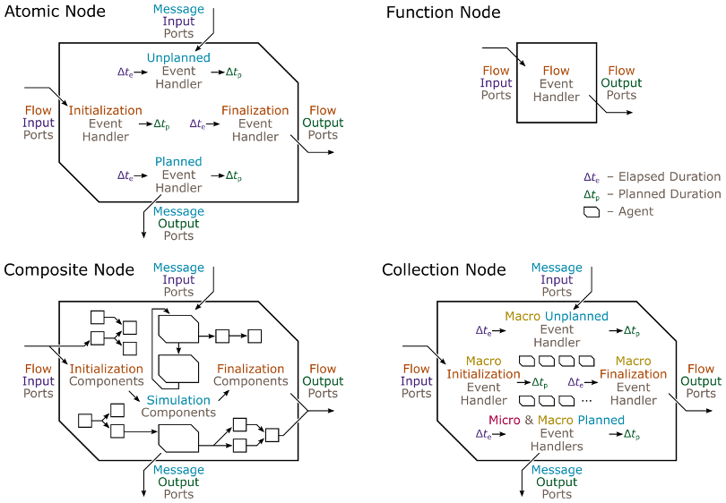

# Overview

Brief Introduction to SyDEVS

## Concept

Using SyDEVS, simulation code is organized into nodes, which can be linked together to form dataflow and simulation networks. The four main types of nodes are illustrated below.



## Example

Here's an example of a SyDEVS atomic node declared in C++. Observe that the four types of ports and four types of event handlers match the atomic node diagram above. The code is taken from the [queueing](https://github.com/Autodesk/sydevs/tree/master/src/examples/demo/queueing) demonstration project, which features an example of each of the four main types of nodes.

```cpp
/**
 * This node processes jobs one at a time. The time required to process a job
 * is determined by the service duration flow input. Any job that arrives while
 * another is being processed is placed in a queue and processed later. The
 * total time spend in an idle state, with no jobs to be processed, is tracked
 * and reported as a flow output.
 */
class queueing_node : public atomic_node
{
public:
    // Constructor/Destructor:
    queueing_node(const std::string& node_name, const node_context& external_context);
    virtual ~queueing_node() = default;

    // Attributes:
    virtual scale time_precision() const { return micro; }

    // Ports:
    port<flow, input, duration> serv_dt_input;    // service duration
    port<message, input, int64> job_id_input;     // job ID (input)
    port<message, output, int64> job_id_output;   // job ID (output)
    port<flow, output, duration> idle_dt_output;  // idle duration

protected:
    // State Variables:
    duration serv_dt;      // service duration (constant)
    std::vector<int64> Q;  // queue of IDs of jobs waiting to be processed
    duration idle_dt;      // idle duration (accumulating)
    duration planned_dt;   // planned duration

    // Event Handlers:
    virtual duration initialization_event();
    virtual duration unplanned_event(duration elapsed_dt);
    virtual duration planned_event(duration elapsed_dt);
    virtual void finalization_event(duration elapsed_dt);
};
```

The complete implementation of the node can be found [here](https://github.com/Autodesk/sydevs/blob/master/src/examples/demo/queueing/queueing_node.h).

## Notable Features

- [Multidimensional Arrays](doc/html/classsydevs_1_1arraynd.html#details): The SyDEVS library includes a generic multidimensional array class template supporting a range of numerical and slicing operations in C++, similar to [NumPy](http://www.numpy.org/) arrays in Python.
- [Standard International (SI) Units](doc/html/classsydevs_1_1quantity.html#details): Quantities can be declared with SI units such as "kilograms" for mass and "meters per second squared" for acceleration. Operations and assignments involving these quantities are checked at compile-time to ensure the units match.
- Multiscale Time (see [related article](https://autodeskresearch.com/publications/multiscale-representation-simulated-time)): The following classes support the recording of past events and scheduling of future events involving any combination of time scales, yet store most event times internally using 64-bit numbers.
  - [quantity](https://autodesk.github.io/sydevs/doc/html/classsydevs_1_1quantity.html) (using the `duration = quantity<seconds>` type alias)
  - [time_point](https://autodesk.github.io/sydevs/doc/html/classsydevs_1_1time__point.html#details)
  - [time_sequence](https://autodesk.github.io/sydevs/doc/html/classsydevs_1_1time__sequence.html#details)
  - [time_queue](https://autodesk.github.io/sydevs/doc/html/classsydevs_1_1time__queue.html#details)
  - [time_cache](https://autodesk.github.io/sydevs/doc/html/classsydevs_1_1time__cache.html#details)

## Related Articles

- [Designing DEVS Visual Interfaces for End-User Programmers](https://autodeskresearch.com/publications/designingdevs) by Maleki et al., 2015 ([PDF](doc/downloads/Maleki__Designing_DEVS__2015-08-13.pdf)): SyDEVS is largely based on the visual programming interfaces proposed in this paper. Although there is currently no graphical modeling tool accompanying the framework, the same node-based models presented visually in the paper can be implemented directly in C++ using the SyDEVS library. Also, the manner in which DEVS is expressed in SyDEVS is largely based on the conventions and terminology proposed in the paper.
- [Multiscale Representation of Simulated Time](https://autodeskresearch.com/publications/multiscale-representation-simulated-time) by Goldstein et al., 2017 ([PDF](doc/downloads/Goldstein__Multiscale_Time__2017-09-05.pdf)): Standard representations of time based on integers or floating-point numbers have serious drawbacks that limit the ability of most frameworks to handle models with dramatically different timescales. The multiscale time representation proposed in this paper is implemented in SyDEVS, allowing models with varying levels of time precision to coexist while keeping rounding errors bounded.
- [The Future of Designing Systems](https://autodeskresearch.com/blog/future-designing-systems) by Rhys Goldstein, 2016: This blog post describes the motivation behind frameworks like SyDEVS, focusing on the design of buildings as systems involving people, controls, and environmental conditions.

## Other DEVS Frameworks

- [Adevs](https://web.ornl.gov/~nutarojj/adevs/) (C++) developed at Oak Ridge National Laboratory
- [CD++](http://cell-devs.sce.carleton.ca/mediawiki/index.php/Main_Page) (C++) by the [ARSLab](http://cell-devs.sce.carleton.ca/ars/) at Carleton University
- [CoSMoS](https://acims.asu.edu/software/cosmos/) (Java) by the [ACIMS](https://acims.asu.edu/) at Arizona State University
- [DesignDEVS](http://simaud.org/resources.php#software) (Lua) by [Autodesk Research](https://autodeskresearch.com/)
- [DEVS-Ruby](https://github.com/devs-ruby/devs) (Ruby) developed at the University of Corsica
- [James II](http://jamesii.informatik.uni-rostock.de/jamesii.org/) (Java) by the [Modeling and Simulation Group](https://mosi.informatik.uni-rostock.de/) at the University of Rostock
- [MS4 Me](http://www.ms4systems.com/pages/ms4me.php) (Java) by [MS4 Systems](http://www.ms4systems.com/pages/main.php)
- [PowerDEVS](https://sourceforge.net/projects/powerdevs/) (C++) developed at the National University of Rosario
- [PythonPDEVS](http://msdl.cs.mcgill.ca/projects/DEVS/PythonPDEVS) (Python) by the [MSDL](http://msdl.cs.mcgill.ca/) (McGill University) and [AnSyMo](https://www.uantwerpen.be/en/research-groups/nexor/team/ansymo/) (University of Antwerp)
- [Virtual Laboratory Environment](http://www.vle-project.org/) (C++)
- [XSY](https://code.google.com/archive/p/x-s-y/) (Python)
