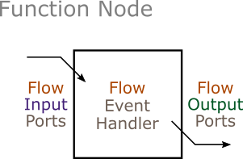

| [Prev](atomic_nodes.html) | [User Manual -- Table of Contents](index.html) | [Next](composite_nodes.html) |
# Function Nodes

The ***function node*** represents a single function that reads a set of input values and calculates a set of output values. It is placed in the dataflow network associated with the initialization or finalization phase of a composite node. In general, the purpose of a function node is to perform some or all of the data processing needed to either prepare parameter values for a simulation or extract statistics from the simulation.



The function node base class is defined in [function_node.h](https://github.com/Autodesk/sydevs/blob/master/src/sydevs/systems/function_node.h), which must be included by all function nodes.

```cpp
#include <sydevs/systems/function_node.h>
```

## Sample Declarations

An example of a function node is the `initial_position_node` class found in [initial_position_node.h](https://github.com/Autodesk/sydevs/blob/master/src/examples/demo/building7m/initial_position_node.h), which is part of the [building7m](https://github.com/Autodesk/sydevs/tree/master/src/examples/demo/building7m) demonstration project. Below is the class declaration, which inherits from `function_node`.

```cpp
class initial_position_node : public function_node
{
public:
    // Constructor/Destructor:
    initial_position_node(const std::string& node_name, const node_context& external_context);
    virtual ~initial_position_node() = default;

    // Ports:
    port<flow, input, std::pair<array2d<int64>, distance>> building_layout_input;
    port<flow, output, array1d<int64>> initial_position_output;

private:
    // Event Handlers:
    virtual void flow_event();
};
```

Another example is the `plus_node` ([plus_node.h](https://github.com/Autodesk/sydevs/blob/master/src/examples/demo/queueing/plus_node.h)), which is part of the [queueing](https://github.com/Autodesk/sydevs/tree/master/src/examples/demo/queueing) project. This node is defined as a class template, allowing it to add together two values of any type. The user can obtain a concrete node type by specifying a type for `T` (e.g. `plus_node<int64>` or `plus_node<float64>`).

```cpp
/**
 * This node adds flow inputs "a" and "b" to produce flow output "c".
 */
template<typename T>
class plus_node : public function_node
{
public:
    // Constructor/Destructor:
    plus_node(const std::string& node_name, const node_context& external_context);
    virtual ~plus_node() = default;

    // Ports:
    port<flow, input, T> a_input;
    port<flow, input, T> b_input;
    port<flow, output, T> c_output;

private:
    // Event Handlers:
    virtual void flow_event();
};
```

## Constructor/Destructor Declarations

Constructors and destructor declarations are the same for all types of nodes (see [Atomic Nodes -- Constructor/Destructor Declarations](atomic_nodes.html#constructordestructor-declarations)).

## Ports

Function node ports are the same as ports on atomic nodes (see [Atomic Nodes -- Ports](atomic_nodes.html#ports)), except that function nodes use flow ports only.

## Constructor Definitions

Constructor definitions are the same as for atomic nodes (see [Atomic Nodes -- Constructor Definitions](atomic_nodes.html#constructor-definitions)), except that the base class is `function_node`. Below is the example from [initial_position_node.h](https://github.com/Autodesk/sydevs/blob/master/src/examples/demo/building7m/initial_position_node.h)

```cpp
inline initial_position_node::initial_position_node(const std::string& node_name, const node_context& external_context)
    : function_node(node_name, external_context)
    , building_layout_input("building_layout_input", external_interface())
    , initial_position_output("initial_position_output", external_interface())
{
}
```

## Event Handlers

Function nodes must override the pure virtual member function `flow_event`.

```cpp
    virtual void flow_event();
```

### Flow Events

The `flow_event` function is invoked once, at any point after all flow input ports have values. These values are obtained using the port member function `value`. The event handler then processes the data and supplies values for all the flow output ports using the `assign` member function.

Below is the flow event handler from [initial_position_node.h](https://github.com/Autodesk/sydevs/blob/master/src/examples/demo/building7m/initial_position_node.h). It obtains as an input an array representing the layout of one floor of a simplified building. It then finds a single location inside the exterior walls of the building, and outputs the coordinates of that location.

```cpp
inline void initial_position_node::flow_event()
{
    array2d<int64> L = building_layout_input.value().first;
    int64 nx = L.dims()[0];
    int64 ny = L.dims()[1];
    array1d<int64> pos({2}, {0, 0});
    bool done = false;
    for (int64 iy = 0; !done && iy < ny; ++iy) {
        for (int64 ix = 0; !done && ix < nx; ++ix) {
            if (L(ix, iy) == 0) {
                // The first indoor grid cell has been found.
                pos(0) = ix;
                pos(1) = iy;
                done = true;
            }
        }
    }
    if (!done) {
        throw std::domain_error("The building has no indoor space.");
    }
    initial_position_output.assign(pos);
}
```

The following flow event handler is from [plus_node.h](https://github.com/Autodesk/sydevs/blob/master/src/examples/demo/queueing/plus_node.h). It outputs the sum of the values of the inputs.

```cpp
template<typename T>
inline void plus_node<T>::flow_event()
{
    // Get the two flow input values, add them together, and assign the result
    // to the flow output port.
    const T& a = a_input.value();
    const T& b = b_input.value();
    T c = a + b;
    c_output.assign(c);
}
```


| [***Continue to Composite Nodes***](composite_nodes.html) |